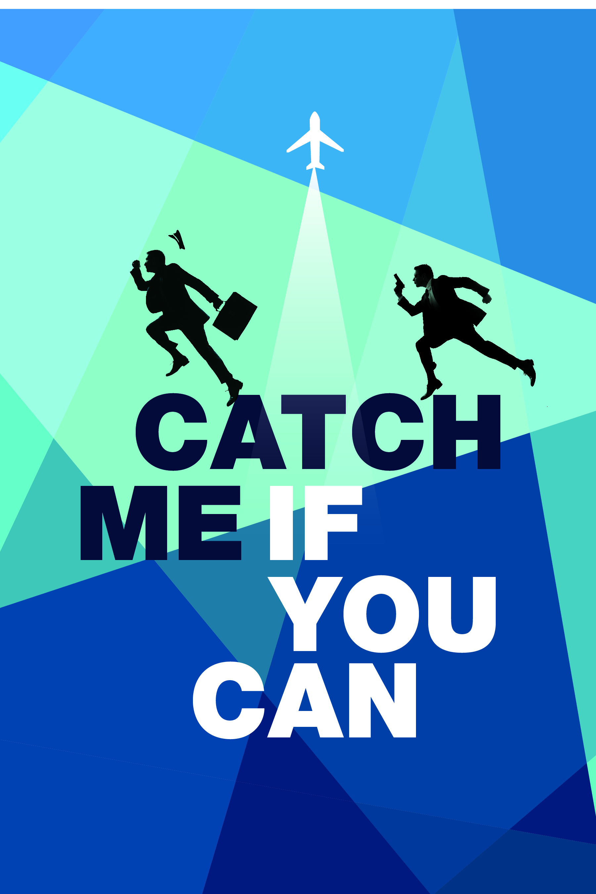

# Catch Me If You Can - Detective Game



Welcome to "Catch Me If You Can," a text-based detective game inspired by the pursuit of Frank Abagnale, a famous con artist. In this game, you step into the shoes of Detective Carl Hanratty, tasked with capturing Frank Abagnale before he reaches the airport. Frank is on the run, and you have only two chances to guess where he'll go next.

## How to Play

1. **Setup**: To play the game, make sure you have Python installed on your computer. Clone this repository to your local machine and navigate to its directory using the command line.

2. **Start the Game**: Run the game by executing the `catch_me_if_you_can.py` file. You can do this by running the following command in your terminal:
   
   ```python catch_me_if_you_can.py```

3. **Gameplay**: You'll start as Detective Carl Hanratty, and the game will provide you with an introduction.

4. **First Move**: You'll be prompted to guess where Frank will go on his first move. You'll have three options to choose from.

5. **Second Move**: If you guess correctly on the first move, congratulations! You've caught Frank Abagnale. If not, you'll get a second chance to guess where he'll go next, but with only three options remaining.

6. **Outcome**: Depending on your guesses, you'll either successfully capture Frank or let him escape to the airport. The game will inform you of the outcome.

7. **Try Again**: After each game, you'll be given the option to play again or quit.

## Game Rules

- You have two chances to guess Frank's moves.
- You win by correctly guessing Frank's location.
- Frank's possible destinations are randomly generated.
- The game will provide hints and feedback on your guesses.

## Technologies Used

This game is a simple Python text-based game that utilizes Python's built-in `random` module for randomness and user input for gameplay.

## Contributions

Contributions to this game are welcome! If you'd like to contribute new features, improve the code, or fix any issues, feel free to create a pull request. Please make sure to follow the existing coding style and comment your changes.

## License

This game is released under the [MIT License](LICENSE).

## Acknowledgments

- This game is inspired by the life of Frank Abagnale, as depicted in the movie "Catch Me If You Can."
- Special thanks to [OpenAI](https://openai.com) for their language model technology that can assist in writing documentation like this.

Enjoy the game, and may you catch Frank Abagnale in time! 🕵️‍♂️🚁
